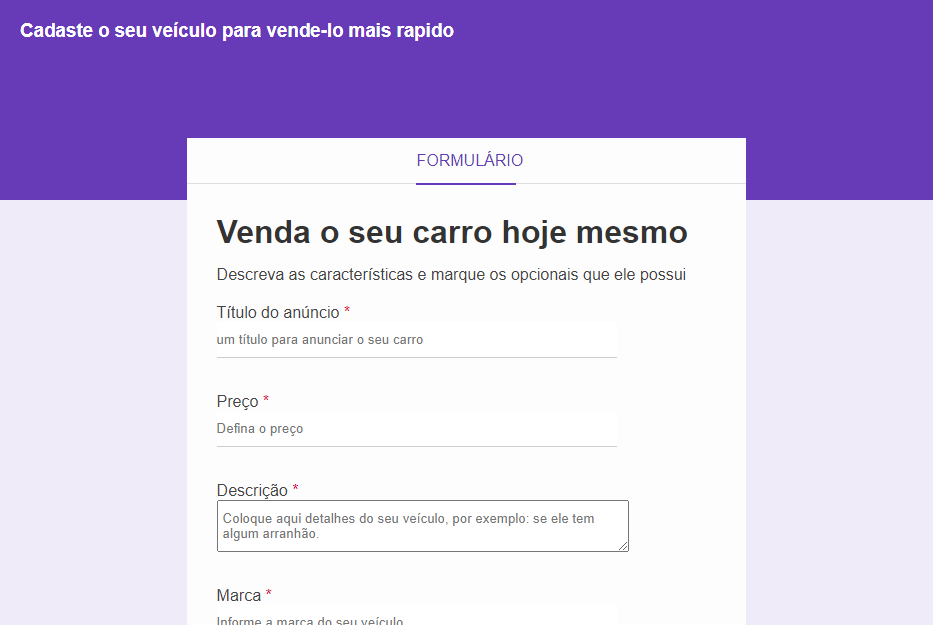
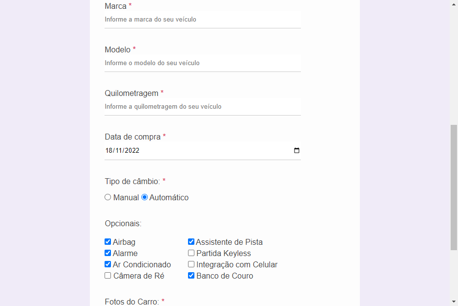
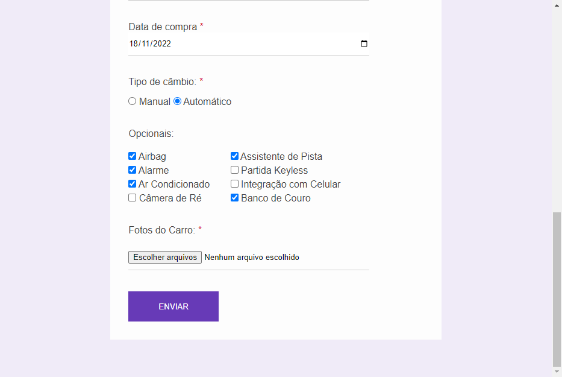

# Formulário

> Treinando fundamentos

Esse projeto foi construido para praticar conceitos básicos de programação web usando HTML e CSS.

Foram adicionados vários campos afim de explorar as varias possibilidaes de construir um formulário.

> Modelo de negócio usado como inspiração.

Como embasamento de négocio o objetivo foi criar um cadastro para que uma pessoa possa cadastrar informações de um veícula que ela deseja vendar.

## Tecnologias

- HTML
- CSS
- Git e GitHub
